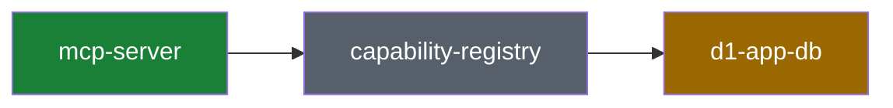

# System recap

Review the system, not just the diff. Every non-trivial PR carries a recap block in its description: which primitives the change touches, classified by risk, with a mermaid system map. GitHub renders the block; the PR is the storage. No service, no deploy, no extra tokens.

The recap is informational and non-blocking. It supplements the PR description and code review; it never replaces reading the diff that matters.

## Two modes, one format

- **Plan mode** (before implementing): describe the intended change against the current system. Put the block in the plan document; move it into the PR description once the PR exists.
- **Recap mode** (PR creation and every meaningful update): describe what the diff actually does. Replaces a plan-mode block.

## Source-of-truth rules

1. **Recap mode reads the diff, not memory.** Generate from `git diff <base>...HEAD` plus `--stat` against the PR base. Session context explains intent; every claim must be checkable against the diff.
2. **Classify against the primitives map** at `docs/contributing/architecture/primitives.yaml`, using its `id` values verbatim. If the repo has no map yet: infer the touched primitives from the code, mark the recap `(inferred — no primitives.yaml)`, and file a work item to author the map.
3. **The map stays current.** A PR that adds, removes, or reshapes a primitive updates `primitives.yaml` in the same PR and says so in the block.

## Risk classification

Classify each touched primitive; the overall classification is the highest severity (`adds` > `extends` > `composes`):

| Classification | Meaning | Risk |
| --- | --- | --- |
| `composes` | Uses existing primitives as-is; wiring and call sites only | Low |
| `extends` | Changes a primitive's behavior, shape, or contract | Medium |
| `adds` | Introduces a new primitive (must update primitives.yaml) | High |

Call out any touched invariant from the map explicitly, whatever the classification. Decide the classification before you open the diff view — it sets the review question ("is this wired right?" vs "is this contract change safe?").

## Block format

The block lives between HTML comment markers, wrapped in `<details>`. Keep the section order fixed — tooling parses this structure. Omit optional sections rather than leaving them empty.

````markdown
<!-- system-recap:start -->

<details>
<summary>System recap — <b>composes existing primitives</b> (low risk)</summary>

**Mode:** recap · **Base:** `main` @ `abc1234` · **Head:** `def5678`

**Classification:** composes — no primitives added or changed; this PR wires
existing primitives together.

### Primitives touched

| Primitive    | Group    | Impact                                  |
| ------------ | -------- | --------------------------------------- |
| `mcp-server` | surfaces | composes                                |
| `d1-app-db`  | storage  | extends — new `jobs.retry_count` column |

### System map



### Change flow

_Optional: a mermaid flowchart or sequence diagram of the specific change._

### Before / after

_Optional: schema, API shape, or route changes as compact before/after fenced
blocks or tables._

### Invariants

_Optional: only when the change touches an invariant from primitives.yaml._

### Plan vs actual

_Recap mode only, when a plan-mode block existed: what shipped as planned and
what drifted, in a short list._

</details>

<!-- system-recap:end -->
````

Format rules:

- The `<summary>` line carries the overall classification and risk in bold, visible without expanding.
- Put a blank line after `<summary>` and around every fenced block, or GitHub will not render markdown inside `<details>`.
- **System map**: show touched primitives plus their immediate neighbors — never the whole map. Use the four `classDef` styles (`touched` = composes, `extended`, `added`, `untouched` for context). Quote node labels that contain spaces.
- Keep the block scannable: tables and diagrams over prose, well under ~120 lines.

## PR description contract

The reviewer's first question is "can I merge this?" — answer it first. A PR description has this order, and `skill://comms` governs every line of it:

1. **Merge readiness block** (format below) at the very top — never inside `<details>`, never below the fold. The verdict is the first line of the body.
2. The summary: what changed and why, answer-first per `skill://comms`.
3. Evidence detail (command outputs, run links) as needed.
4. The system recap `<details>` block last — architecture context may collapse; risk may not.

## Merge readiness block

Lives between its own markers so tooling can upsert it independently (`upsert-recap-block.mjs <pr> <file> --marker merge-readiness --prepend`):

````markdown
<!-- merge-readiness:start -->

### 🟢 Merge ready — confidence 5/5, consequence moderate

|  |  |
| --- | --- |
| **Confidence** | 5/5 — every load-bearing claim evidenced below |
| **Consequence if wrong** | moderate — blocked PRs; false-green = status quo |
| **Recovery** | one-commit revert |
| **Review** | effort 2/5 · read gate script → workflow → docs |

| # | Claim | Evidence |
| --- | --- | --- |
| 1 | Gate fails on regression | red-path run output, exit 1 (link) |
| 2 | Current main passes | live CI run 30853482738, green in 3m58s |

<!-- merge-readiness:end -->
````

Heading verdicts, by traffic light:

| Emoji | Heading | When |
| --- | --- | --- |
| 🟢 | Merge ready | confidence ≥ 4 AND consequence ≤ moderate |
| 🟡 | Merge with caution | confidence 3, OR consequence major |
| 🔴 | Do not merge yet | confidence ≤ 2, OR consequence catastrophic (always red, whatever the confidence — this is the low-likelihood × catastrophic callout) |

Required in recap mode. Keep the evidence table to the load-bearing claims — 3 to 7 rows. This block is this stack's extension to the upstream kcd format; parsers treat unknown blocks and sections as optional.

**Boot proof rule:** when the diff touches anything the app executes or loads at startup — app code, config files read at boot (vite/vitest/framework config), dependency manifests, build tooling — the evidence packet MUST include a boot row: the app built and booted on this branch and key routes answered. When the diff touches authenticated surfaces or flows, the evidence packet MUST include an authenticated row: a real sign-in (or minted test token) exercised the protected route, plus a 401/redirect proof that the gate still gates. Unit tests and config-load smokes do not substitute for a running app.

## Merge readiness — likelihood, consequence, evidence

Risk has two independent axes. Score both; never blend them into one number.

**Confidence (likelihood the change is correct) — evidence drives this up:**

| Score | Meaning | Action |
| --- | --- | --- |
| 5/5 | Every load-bearing claim has direct evidence (live run, red+green path, screenshot) | Merge |
| 4/5 | Core behavior evidenced; periphery inferred | Merge after small fixes |
| 3/5 | Local verification only, or evidence gaps on real claims | Address gaps first |
| 2/5 | Compiles and unit-tests only | Needs verification work |
| 0–1/5 | Untested or unverifiable | Do not merge |

**Consequence (what happens if it is wrong anyway) — evidence CANNOT reduce this; only design can (reversibility, feature flags, staged rollout):**

| Level | Meaning |
| --- | --- |
| catastrophic | Money moved wrongly, data lost, tenant isolation broken, security hole |
| major | User-facing outage or wrong user-visible money/data display |
| moderate | Internal breakage, blocked developers, recoverable state |
| minor | Cosmetic, logs, docs |

Rules:

- State both scores and the recovery path (how many commits to revert; any irreversible step) on the first line of the section.
- **Low likelihood × catastrophic consequence gets called out explicitly** and named in the `<summary>` line — a 1% chance of a wrong refund calculation outranks a 50% chance of a broken lint rule. Consequence ≥ major always names its recovery path and asks for deeper review, whatever the confidence.
- The **evidence packet** is what earns the confidence score: one row per load-bearing claim, each pointing at a command with output, a live CI run, or a visual. UI changes MUST attach screenshots or a GIF walkthrough — prose cannot prove a rendered surface. Claims without evidence rows cap confidence at 3/5.
- **Review effort** (1–5, CodeRabbit-style: files × nature × logic complexity) and a suggested **read order** through the diff give the reviewer an entry path.
- Confidence is contextual to consequence: say "4/5 on a money path" rather than letting a bare number reassure.

## Workflow

### Recap mode (PR create/update)

1. Read `docs/contributing/architecture/primitives.yaml` (or note its absence).
2. Get the facts: `gh pr view <n> --json baseRefName,headRefName`, then `git diff <base>...HEAD --stat` and the full diff for anything you did not author this session.
3. Map changed paths to primitives; classify each; roll up.
4. Author the block in the format above.
5. Upsert it: `node <this-skill-dir>/scripts/upsert-recap-block.mjs <pr-number> <block-file> [--repo owner/name]`. The script replaces content between the markers, or appends the block on first run. It never touches text outside the markers.
6. Re-run steps 2–5 after pushing significant new commits.

### Plan mode

Same steps, except: `**Mode:** plan`, no Base/Head commits, and "Primitives touched" describes intended impact. When the plan needs **no** primitive change, say so in one line — that is the lowest-risk outcome and worth stating. When implementation later drifts, record it in "Plan vs actual".

---

Adapted from [kentcdodds/kcd-skills](https://github.com/kentcdodds/kcd-skills) `visual-recap` (MIT). Block format kept compatible for future ingestion tooling.
